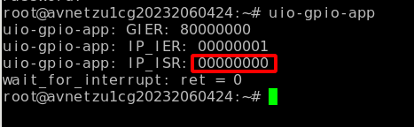

<p>
<div align="center">
  <h1 align="center">Testing UIO with Interrupt on Zynq Ultrascale</h1>
</div>
</p>

<p align="center">
  
</p>

# Introduction
Forked from: https://xterra2.avnet.com/uio/testing-uio-with-interrupt-on-zynq-ultrascale!!!!
In this GitLab, we will explore the application of the UIO framework to develop a Linux User Space device driver, which will facilitate the testing of an AXI GPIO interrupt. `Note` - this lab is an update to an antiquated 2019 Xilinx wiki project of the same name: <a href="https://xilinx-wiki.atlassian.net/wiki/spaces/A/pages/18842490/Testing+UIO+with+Interrupt+on+Zynq+Ultrascale">Testing UIO with Interrupt on Zynq+Ultrascale</a>

# Table Of Contents
- [Introduction](#introduction)
- [Building the Hardware](#building-the-hardware)
- [Create the Linux Image in Petalinux](#create-the-linux-image-in-petalinux)
  * [system-user.dtsi](#system-userdtsi)
- [Userspace](#userspace)
- [UIO List Application (lsuio)](#uio-list-application--lsuio-)
  * [Getting information about your UIO device](#getting-information-about-your-uio-device)
  * [Creating Petalinux LSUIO Application](#creating-petalinux-lsuio-application)
  * [Building Petalinux LSUIO Application](#building-petalinux-lsuio-application)
  * [Testing LSUIO Application](#testing-lsuio-application)
- [Test the Interrupt](#test-the-interrupt)
- [Example User Space Driver](#example-user-space-driver)
  * [Pseudo Code](#pseudo-code)
    + [main()](#main--)
    + [wait_for_interrupt()](#wait-for-interrupt--)
    + [reg_write()](#reg-write--)
    + [reg_read()](#reg-read--)
  * [Sample UIO Driver](#sample-uio-driver)
    + [uio-gpio-app.c](#uio-gpio-appc)
- [Add Application To PetaLinux](#add-application-to-petalinux)
  * [Build New Application](#build-new-application)
  * [Create New RootFS](#create-new-rootfs)
- [Running Application](#running-application)
  * [Before Pushbutton](#before-pushbutton)
  * [After Pushbutton](#after-pushbutton)

<small><i><a href='http://ecotrust-canada.github.io/markdown-toc/'>Table of contents generated with markdown-toc</a></i></small>


# Building the Hardware
To assess this method, we designed a block architecture incorporating an AXI GPIO in the programmable logic. This GPIO was enabled with an interrupt feature and linked to the PS IRQ to facilitate communication.

<p align="center">
  
</p>

# Create the Linux Image in Petalinux

Petalinux 2023.2 was used to create the Image with the following steps:

``` ruby
  - petalinux-create -t project --template zynqMP -n linux_images
    cd linux_images
  - petalinux-config --get-hw-description <Vivado_Export_to_SDK_Directory>/system.xsa
  - petalinux-config -c kernel
    - Device Drivers -> Userspace I/O drivers
      - <*> Userspace I/O platform driver with generic IRQ handling
      - <*> Userspace platform driver with generic irq and dynamic memory
      - <*> Xilinx AI Engine driver
```
## system-user.dtsi
The kernel offers a `uio_pdrv_genirq` driver, depicted by the blue driver block below, which utilizes the core uio framework to manage generic IRQs efficiently.

<p align="left">
  
</p>

The device tree also requires updates to support UIO and the uio pdrv. To enable the PDRV module upon boot, modify the bootargs using system-user.dtsi. Open the system-user.dtsi in linux-images\project-spec\meta-user\recipes-bsp\device-tree\files and make the mods below:

``` ruby
/include/ "system-conf.dtsi"
/ {
  / {
   chosen {
      bootargs = "earlycon console=ttyPS0,115200 clk_ignore_unused uio_pdrv_genirq.of_id=generic-uio,ui_pdrv root=/dev/mmcblk0p2 rw rootwait cma=512M";
      xlnx,eeprom= &mac_eeprom;
   };
};

&axi_gpio_0 {
    compatible = "generic-uio,ui_pdrv";
};
```

The Linux kernel offers a userspace I/O subsystem (UIO) that allows certain types of drivers to be predominantly written in userspace. This is achieved through a character device that user programs can open, memory map, and use for I/O operations. Additionally, this device can be utilized to handle interrupts.

# Userspace

After compiling the provided device tree and passing it to the kernel, the generic IRQ driver module is loaded via the bootargs. As a result, you should observe the creation of /dev/uio0.

A userspace program can use the UI device node as follows:

1. `open()` the device node in read-write (O_RDWR)
2. `write()` to the device to unmask the interrupt
3. `read()` from the device to block until an interrupt arrives. You can also use `select()` or `poll()` or whatever blocking method you prefer. Go back to step 2 to handle the next interrupt. A `select()` or `poll()` call is much more efficient than a simple `read()` due to the way the UIO event handling is implemented internally.
4. `close()` the device to mask off the interrupt and clean up.

All reads and writes are handled by transferring exactly a 32-bit unsigned integer (that is, 4 bytes).

Keep in mind that you can look at `/proc/interrupts` to check the number of interrupt counts for the GPIO line in question. This lets you know if the interrupt is happening at all or whether an IRQ storm has happened. The counter increments for every interrupt event.

# UIO List Application (lsuio)
## Getting information about your UIO device

Information about all UIO devices is available in sysfs. The first thing you should do in your driver is check name and version to make sure your talking to the right device and that its kernel driver has the version you expect.

You should also make sure that the memory mapping you need exists and has the size you expect.

There is a tool called `lsuio` that lists UIO devices and their attributes (**see the Files directory at the top of this gitlab for the source files: ./Files/lsuio**)

With lsuio you can quickly check if your kernel module is loaded and which attributes it exports. Have a look at the manpage for details.

The source code of `lsuio` can serve as an example for getting information about an UIO device. The file `uio_helper.c` contains a lot of functions you could use in your userspace driver code.

## Creating Petalinux LSUIO Application
After extracting the lsuio files into your `~/Downloads` director follow the steps below:
```ruby
Host>$ cd /YourYoctoProject
Host>$ petalinux-create -t apps -n lsuio --enable
Host>$ cd project-spec/meta-user/recipes-apps/lsuio
Host>$ cp ~/Downloads/lsuio.bb .
Host>$ cp ~/Downloads/Makefile ./files
Host>$ cp ~/Downloads/lsuio.c ./files
Host>$ cp ~/Downloads/uio_helper.h ./files
Host>$ cp ~/Downloads/uio_helper.c ./files
Host>$ tree
```

```ruby
HOST>$ tree
.
├── files
│   ├── lsuio.c
│   ├── Makefile
│   ├── system.h
│   ├── uio_helper.c
│   └── uio_helper.h
├── lsuio.bb
└── README
```
## Building Petalinux LSUIO Application
```ruby
Host>$petalinux-build -c lsuio
Host>$petalinux-build -x distclean
Host>$petalinux-build
Host>$petalinux-package --force --boot --fsbl ./images/linux/zynqmp_fsbl.elf --fpga ./images/linux/system.bit --pmufw ./images/linux/pmufw.elf --u-boot ./images/linux/u-boot.elf
```
## Testing LSUIO Application
Update the target with the newly updated images and verify that the `lsuio` application exists.
```ruby
root@avnetzu1cg20232060424:~# lsuio -h
List UIO devices.
Usage: lsuio [OPTIONS]
Options:
  -h, --help       display this help and exit
  -m, --mmap       test if mmap() works for all mappings
  -v, --verbose    also display device attributes
  -V, --version    output version information and exit
```
```ruby
root@avnetzu1cg20232060424:~# lsuio -m -v
uio0: name=gpio, version=devicetree, events=0
        map[0]: addr=0xA0000000, size=65536, mmap test: OK
        Device attributes:
        uevent=DRIVER=uio_pdrv_genirq
        modalias=of:NgpioT(null)Cgeneric-uio,ui_pdrv
        driver_override=(null)
```
```ruby
root@avnetzu1cg20232060424:~# ls /sys/class/uio/ -l
total 0
lrwxrwxrwx    1 root     root             0 Nov  8 14:45 uio0 -> ../../devices/platform/amba_pl@0/a0000000.gpio/uio/uio0
```
# Test the Interrupt

To test, make sure that the UIO is probed:

```ruby
    ls /dev/uio*
```
You should see that the uio0 is listed here.

<p align="left">
  
</p>

Make sure that the IRQ is registered:
```ruby
    cat /proc/interrupts
```
You should see this registered as below:
<p align="left">
  
</p>

To generate an interrupt, we write to the ISR register for the `AXI GPIO`. Below is a snippet of the register space from the `AXI GPIO` product guide (`Note` - the base address of the AXI gpio is configured in Vivado and can be found in the system.dtb file, ex. `0xa0000000`)

<p align="left">
  
</p>

The following register settings are used to set and then clear the AXI gpio channel 1 interrupt:

| Register | Address | Setting |
| :---         | :---:    | ---:          |
GEIR  | 0xa000011c | 0x80000000
IP_IER | 0xa0000128 | 0x00000001
IP_ISR (s) | 0xa0000120 | 0x00000001
IP_ISR (c) | 0xa0000120 | 0x00000000

The devmem utility is used to write to this register from the linux console:

<p align="left">
  
</p>

The interrupt is set and cleared by writing a '1' to the the `IP_ISR` register.
<p align="left">
  
</p>

`Note` - the SW3 pushbutton can also be used to create an interrupt. This process will be discussed in detail later in the lab.

# Example User Space Driver
In the following section, we will explore an example of a User Space Driver Application that manages GPIO push button interrupts. The application consists of four main functions: `main()`, `wait_for_interrupt()`, `reg_write()`, and `reg_read()`. Initially, we will examine the pseudocode for each function, followed by a review of the `uio-gpio-app.c` file in its complete form.

## Pseudo Code
### main()
```ruby
Function main
    Input: argc - an integer representing the number of command-line arguments,
           argv - an array of strings representing the command-line arguments
    Output: An integer representing the exit status of the program

    1. Declare a pointer for the AXI GPIO device
    2. Declare and initialize variables for re-enabling interrupts, GPIO size, and value
    3. Open the UIO device file with read/write permissions
    4. If the file descriptor is invalid, print an error and exit the program
    5. Memory-map the UIO device
    6. Enable global interrupts by writing to the GPIO global interrupt register
    7. Enable channel 1 interrupts by writing to the GPIO interrupt control register
    8. Re-enable the interrupt controller through the UIO subsystem
    9. Read and print the values of the global interrupt register, interrupt control register, and interrupt status register
    10. Call the function to wait for an interrupt
    11. Unmap the memory-mapped UIO device
    12. Close the file descriptor
    13. Exit the program successfully
```

### wait_for_interrupt()
```ruby
Function wait_for_interrupt
    Input: fd_int - an integer file descriptor, gpio_ptr - a pointer to the GPIO device
    Output: ret - an integer representing the result of the poll operation

    1. Initialize count, bntd_flag, bntu_flag, pending, reenable, flag_end, reg, and value
    2. Set up the file descriptor and event for polling
    3. Poll the file descriptor with a timeout
    4. If the poll returns a positive number, handle the interrupt:
        a. Read the interrupt status
        b. Optionally, read the GPIO data and perform an action (commented out)
        c. Delay to debounce
        d. Clear the interrupt status register if an interrupt occurred
        e. Re-enable the interrupt
    5. Return the result of the poll operation
```
### reg_write()
```ruby
Function reg_write
    Input: reg_base - a pointer to the base address of the register,
           offset - an unsigned long representing the offset from the base address,
           value - an unsigned long representing the value to write to the register
    Output: None

    1. Calculate the actual address to write to by adding the offset to the base address
    2. Cast the calculated address to a pointer to an unsigned integer
    3. Write the value to the calculated address
```
### reg_read()
```ruby
Function reg_read
    Input: reg_base - a pointer to the base address of the register,
           offset - an unsigned long representing the offset from the base address
    Output: The value read from the register

    1. Calculate the actual address to read from by adding the offset to the base address
    2. Cast the calculated address to a pointer to an unsigned integer
    3. Return the value read from the calculated address
```

## Sample UIO Driver

### uio-gpio-app.c   
```ruby
#include <sys/types.h>
#include <sys/stat.h>
#include <fcntl.h>
#include <stdio.h>
#include <stdlib.h>
#include <stdint.h>
#include <unistd.h>
#include <sys/mman.h>
#include <poll.h>

#define GPIO_DATA_OFFSET 0x00
#define GPIO_TRI_OFFSET 0x04
#define GPIO_DATA2_OFFSET 0x08
#define GPIO_TRI2_OFFSET 0x0C
#define GPIO_GLOBAL_IRQ 0x11C
#define GPIO_IRQ_CONTROL 0x128
#define GPIO_IRQ_STATUS 0x120
#define GPIO_MAP_SIZE 0x10000

/* Prototypes */
unsigned int get_memory_size(char *sysfs_path_file);
uint8_t wait_for_interrupt(int fd_int, void *gpio_ptr);
unsigned long reg_read(void *reg_base, unsigned long offset);
void reg_write(void *reg_base, unsigned long offset, unsigned long value);

/**
 * @brief Entry point of the program. It opens a file descriptor, enables global and channel interrupts,
 * reads interrupt registers, waits for an interrupt, and cleans up before exiting.
 *
 * @param argc The count of command-line arguments.
 * @param argv The array of command-line arguments.
 * @return int The exit status of the program.
 */
int main(int argc, char *argv[])
{
    void *ptr_axi_gpio;
    uint32_t reenable = 1;
    unsigned int gpio_size = 0;
    unsigned int value = 0;

    int fd = open("/dev/uio0", O_RDWR);
    if (fd < 0) {
        perror("open");
        exit(EXIT_FAILURE);
    }

    /* mmap the UIO devices */
    ptr_axi_gpio = mmap(NULL, GPIO_MAP_SIZE, PROT_READ|PROT_WRITE, MAP_SHARED, fd, 0);

    // Global interrupt enable, Bit 31 = 1
    reg_write(ptr_axi_gpio, GPIO_GLOBAL_IRQ, 0x80000000);

    // Channel 1 Interrupt enable
    reg_write(ptr_axi_gpio, GPIO_IRQ_CONTROL, 1);

    // enable the interrupt controller thru the UIO subsystem
    write(fd, (void *)&reenable, sizeof(int));

    /* Print Interrupt Registers */
    value = reg_read(ptr_axi_gpio, GPIO_GLOBAL_IRQ);
    printf("%s: GIER: %08x\n", argv[0], value);
    value = reg_read(ptr_axi_gpio, GPIO_IRQ_CONTROL);
    printf("%s: IP_IER: %08x\n", argv[0], value);
    value = reg_read(ptr_axi_gpio, GPIO_IRQ_STATUS);
    printf("%s: IP_ISR: %08x\n", argv[0], value);

    /* Wait on interrupt */
    wait_for_interrupt(fd, ptr_axi_gpio);

    munmap(ptr_axi_gpio, gpio_size);
    close(fd);
    exit(EXIT_SUCCESS);
}

/**
 * @brief Wait for an interrupt on a file descriptor and handle it.
 *
 * @param fd_int File descriptor to wait on.
 * @param gpio_ptr Pointer to the base address of the GPIO device.
 * @return uint8_t The result of the poll operation.
 */
uint8_t wait_for_interrupt(int fd_int, void *gpio_ptr)
{
	static unsigned int count = 0, bntd_flag = 0, bntu_flag = 0;
	int pending = 0;
	int reenable = 1;
	int flag_end = 0;
	unsigned int reg;
	unsigned int value;

	// block (timeout for poll) on the file waiting for an interrupt
	struct pollfd fds = {
        .fd = fd_int,
        .events = POLLIN,
        };

	int ret = poll(&fds, 1, 100);
	printf("%s: ret = %d\n", __func__, ret);
	if (ret >= 1) {
    // &reenable -> &pending
		read(fd_int, (void *)&reenable, sizeof(int));
#ifdef COMMENT_OUT
		// channel 1 reading
		value = reg_read(gpio_ptr, GPIO_DATA_OFFSET);
		if ((value & 0x00000001) != 0) {
			do something
		}
#endif
		// anti rebond
		usleep(50000);

		// the interrupt occurred for the 1st GPIO channel so clear it
		reg = reg_read(gpio_ptr, GPIO_IRQ_STATUS);
		if (reg != 0) {
			printf("%s: Clearing ISR register:\n", __func__);
			reg_write(gpio_ptr, GPIO_IRQ_STATUS, 1);
                        usleep(50000); // anti rebond
                        value = reg_read(gpio_ptr, GPIO_IRQ_STATUS);
                        printf("%s: IP_ISR: %08x\n",__func__, value);
		}
		// re-enable the interrupt in the interrupt controller thru the
		// the UIO subsystem now that it's been handled
		write(fd_int, (void *)&reenable, sizeof(int));
	}
	return ret;
}

/**
 * @brief Write a value to a register at a specified offset from the base address.
 *
 * @param reg_base Base address of the register to write to.
 * @param offset Offset from the base address where the value should be written.
 * @param value The value to write to the register.
 */
void reg_write(void *reg_base, unsigned long offset, unsigned long value)
{
	*((unsigned *)(reg_base + offset)) = value;
}

/**
 * @brief Read a value from a register at a specified offset from the base address.
 *
 * @param reg_base Base address of the register to read from.
 * @param offset Offset from the base address where the value should be read.
 * @return unsigned long The value read from the register.
 */
unsigned long reg_read(void *reg_base, unsigned long offset)
{
	return *((unsigned *)(reg_base + offset));
}
```
# Add Application To PetaLinux
Download uio-gpio-app.c from the Files folder above. Then create a new application program in you petalinux project. We will be overwriting the uio-gpio-app.c with the one download from this gitlab.

```ruby
Host>cd /YourPetaProject
HOST>petalinux-create -t apps --name uio-gpio-app --enable
HOST>cd project-spec/meta-user/recipes-apps/uio-gpio-app/files
HOST>cp ~/Downloads/uio-gpio-app.c .
```
## Build New Application
```ruby
HOST>cd YourPetaProject
HOST>petalinux-build -c uio-gpio-app -x distclean
HOST>petalinux-build -c uio-gpio-app
```
## Create New RootFS
```ruby
HOST>petalinux-build -c rootfs -x distclean
HOST>petalinux-build -c rootfs
HOST>petalinux-build -x distclean; petalinux-build
```

The next step is to create a new SD card with our updates and boot the target. In my case it is a ZCU1CG demo board.

# Running Application
## Before Pushbutton
Begin by running the UIO GPIO application, but do not activate the pushbutton interrupt. Observe that the Global Interrupt Enable Register (GIER) is activated with a setting of 0x80000000. The interrupt for GPIO channel 1 is enabled with the setting 0x00000001 in the Interrupt Enable Register (IP_IER). Finally, the Interrupt Status Register (IP_ISR) indicates that there are no interrupts, as shown by the register content of 0x00000000.

  <p align="left">
    
  </p>

Next, generate an interrupt by pushing the `User Push Button SW3` marked with a red box:

  <p align="left">
    
  </p>

## After Pushbutton
After an interrupt is generated, we examine the Interrupt Status Register to verify that the channel 1 ISR is active, which is indicated by the 0x00000001 in the first red block. The interrupt handler will address the interrupt and then reset the ISR, as indicated by the second red block showing all zeros. Finally, the ISR handler will re-enable the interrupt in the interrupt controller through the UIO subsystem, now that it has been processed.
<p align="left">
  
</p>

A look at `proc/interrupts` will show the interrupt count increasing after each SW3 pushbutton is pressed.
<p align="left">
  
</p>
