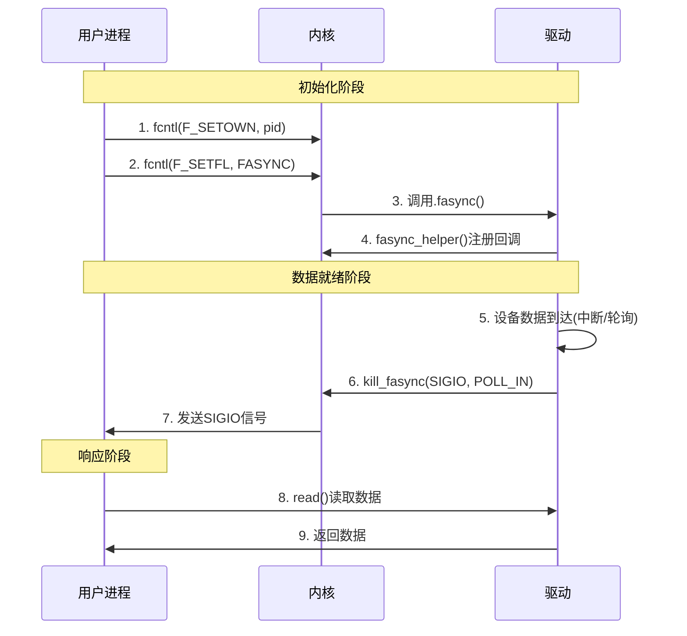

# fasync on zynq

## fasync diagram

```mermaid
sequenceDiagram
    participant 用户进程
    participant 内核
    participant 驱动

    Note over 用户进程,驱动: 初始化阶段
    用户进程->>内核: 1. fcntl(F_SETOWN, pid)
    用户进程->>内核: 2. fcntl(F_SETFL, FASYNC)
    内核->>驱动: 3. 调用.fasync()
    驱动->>内核: 4. fasync_helper()注册回调

    Note over 用户进程,驱动: 数据就绪阶段
    驱动->>驱动: 5. 设备数据到达(中断/轮询)
    驱动->>内核: 6. kill_fasync(SIGIO, POLL_IN)
    内核->>用户进程: 7. 发送SIGIO信号

    Note over 用户进程: 响应阶段
    用户进程->>驱动: 8. read()读取数据
    驱动->>用户进程: 9. 返回数据
```

## test
