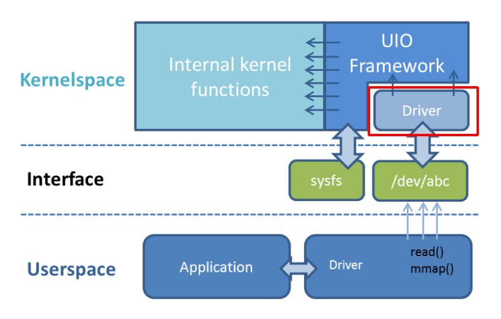
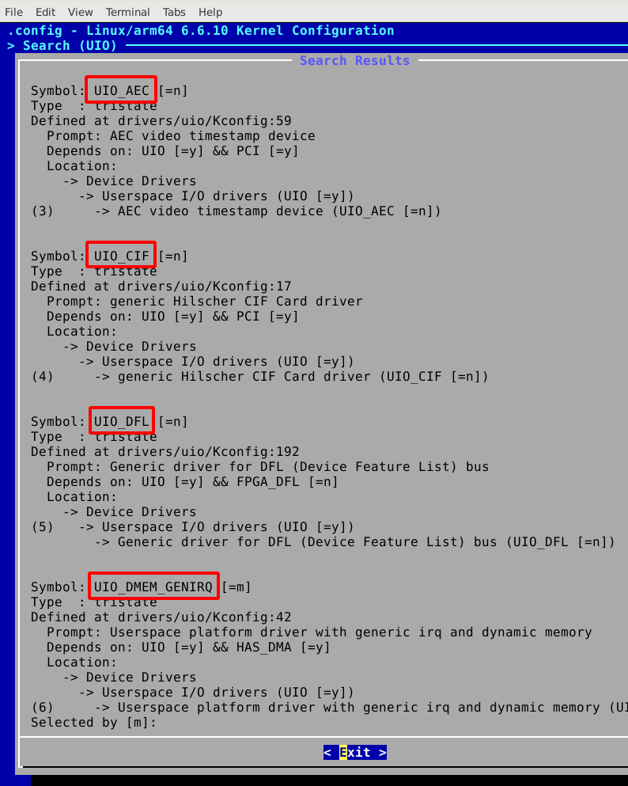
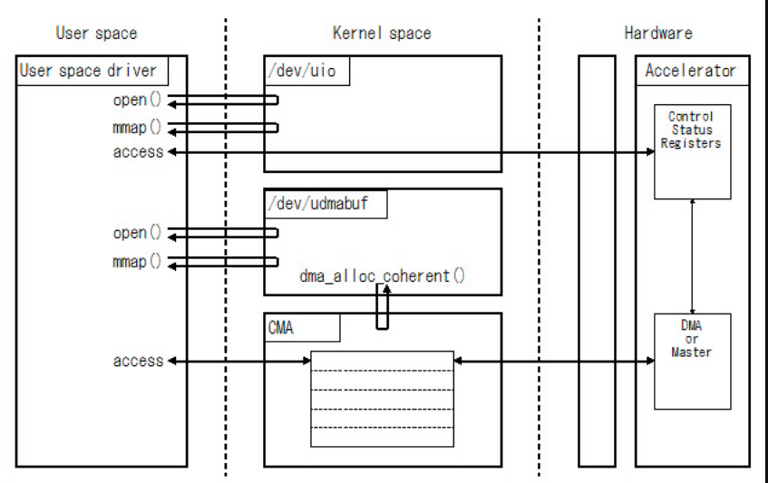

<p>
<div align="center">
  <h1 align="center">Understanding  Linux Provided UIO Kernel Drivers</h1>
</div>
</p>

<p align="center">
  
</p>

# Introduction
The Linux UIO (`User Input/Output`) framework facilitates the creation of user-space device drivers by providing a minimal kernel-space driver component. This component's primary functions are:

- `Identifying device memory regions for user-space access`.
- `Registering for device interrupts and signaling these to user-space`.

<p align="center">
  
</p>

The device is made accessible through sysfs entries, typically named `/dev/uioXX`. User-space drivers locate these entries to read device address ranges and map them into user-space memory, enabling direct device management, including I/O operations.

For interrupt handling, the user-space driver must execute a blocking `read()` on the device entry. This action prompts the kernel-space component to put the user-space application into a sleep state, which is then interrupted and awakened upon receiving a device interrupt.

# Table Of Contents
- [Linux UIO Kernel Driver Support](#linux-uio-kernel-driver-support)
  * [UIO Kernel Driver Table](#uio-kernel-driver-table)
  * [Linux UIO Kernel Driver Configuration](#linux-uio-kernel-driver-configuration)    
  - [Generic Driver Overview](#generic-driver-overview-1)
    * [Generic Platform Driver with Interrupt (uio_pdrv_genirq)](#generic-platform-driver-with-interrupt--uio-pdrv-genirq-)
      + [Example Driver](#example-driver-1)
    * [Generic PCI Driver (uio_pci_generic)](#generic-pci-driver--uio-pci-generic-)
      + [Things to know about uio_pci_generic](#things-to-know-about-uio-pci-generic-1)
      + [Writing userspace driver using uio_pci_generic](#writing-userspace-driver-using-uio-pci-generic-1)
      + [Example code using uio_pci_generic](#example-code-using-uio-pci-generic-1)
    * [Generic Dynamic Memory Driver with Interrupt (uio_dmem_genirq)](#generic-dynamic-memory-driver-with-interrupt--uio-dmem-genirq--1)


# Linux UIO Kernel Driver Support

The small kernel driver in the Userspace I/O (UIO) system serves several essential purposes:

  - Device Initialization: The kernel driver sets up the device, initializes its hardware, and performs any necessary configuration. This step ensures that the device is ready for communication.

  - Memory Mapping: The driver maps device memory to user space. This mapping allows user applications to directly access the device’s memory regions without going through the kernel. UIO provides an interface for this memory mapping.

  - Interrupt Handling: The kernel driver handles interrupts generated by the device. When an event occurs (such as data arriving from the device), the module triggers an interrupt, allowing user space applications to respond promptly.

  - Resource Management: The driver manages resources associated with the device, such as memory regions, I/O ports, and interrupt lines. It ensures proper cleanup when the device is no longer needed.

By offloading these tasks to a small kernel driver, UIO simplifies driver development and allows most of the driver logic to reside in user space. This separation enhances stability, security, and ease of maintenance.

## UIO Kernel Driver Table

Linux offers a collection of UIO kernel drivers to support UIO applications. The table below lists the driver names and provides brief descriptions of their purposes.

| UIO Kernel Drivers | Definition |
| ---      | --- |
|  UIO_CIF  | generic Hilscher CIF Card drive |
| UIO_PDRV_GENIRQ | Userspace I/O platform driver with generic IRQ handling |
|UIO_DMEM_GENIRQ| Userspace platform driver with generic irq and dynamic memory |
| UIO_AEC | AEC video timestamp device |
| UIO_SERCOS3 | Automata Sercos III PCI card driver |
| UIO_PCI_GENERIC | Generic driver for PCI 2.3 and PCI Express cards |
| UIO_NETX | Hilscher NetX Card driver |
| UIO_FSL_ELBC_GPCM | eLBC/GPCM driver |
| UIO_FSL_ELBC_GPCM_NETX5152 | eLBC/GPCM netX 51/52 support |
| UIO_PRUSS | Texas Instruments PRUSS driver |
| UIO_MF624 | Humusoft MF624 DAQ PCI card driver |
| UIO_HV_GENERIC | Generic driver for Hyper-V VMBus |
| UIO_XILINX_APM | Xilinx AXI Performance Monitor driver |
| UIO_XILINX_AI_ENGINE | Xilinx AI Engine driver |
| UIO_DFL | Generic driver for DFL (Device Feature List) bus |

The source code repository for the Xilinx/AMD UIO kernel drivers can be accessed <a href="https://github.com/Xilinx/linux-xlnx/tree/master/drivers/uio">here</a>.

## Linux UIO Kernel Driver Configuration
The UIO Framework is enabled and configured using the `petalinux-config -c kernel` command:

```ruby
HOST>/YourPetalinuxProject$ petalinux-config -c kernel
```

The Kconfig file for the UIO framework provides definitions for each of the UIO kernel drivers.

<p align="left">
  
</p>

A complete list of drivers is provided below. For a detailed explanation of each driver’s use case, refer to the help section of the respective driver. Note: Some drivers support a user space component (e.g., UIO_CIF):

```ruby
# SPDX-License-Identifier: GPL-2.0-only
menuconfig UIO
	tristate "Userspace I/O drivers"
	depends on MMU
	select DMA_SHARED_BUFFER
	help
	  Enable this to allow the userspace driver core code to be
	  built.  This code allows userspace programs easy access to
	  kernel interrupts and memory locations, allowing some drivers
	  to be written in userspace.  Note that a small kernel driver
	  is also required for interrupt handling to work properly.

	  If you don't know what to do here, say N.
```

```ruby
if UIO

config UIO_CIF
	tristate "generic Hilscher CIF Card driver"
	depends on PCI
	help
	  Driver for Hilscher CIF DeviceNet and Profibus cards.  This
	  driver requires a userspace component called cif that handles
	  all of the heavy lifting and can be found at:
	        <http://www.osadl.org/projects/downloads/UIO/user/>

	  To compile this driver as a module, choose M here: the module
	  will be called uio_cif.
```    
```ruby
config UIO_PDRV_GENIRQ
	tristate "Userspace I/O platform driver with generic IRQ handling"
	help
	  Platform driver for Userspace I/O devices, including generic
	  interrupt handling code. Shared interrupts are not supported.

	  This kernel driver requires that the matching userspace driver
	  handles interrupts in a special way. Userspace is responsible
	  for acknowledging the hardware device if needed, and re-enabling
	  interrupts in the interrupt controller using the write() syscall.

	  If you don't know what to do here, say N.
```
```ruby
config UIO_DMEM_GENIRQ
	tristate "Userspace platform driver with generic irq and dynamic memory"
	depends on HAS_DMA
	help
	  Platform driver for Userspace I/O devices, including generic
	  interrupt handling code. Shared interrupts are not supported.

	  Memory regions can be specified with the same platform device
	  resources as the UIO_PDRV drivers, but dynamic regions can also
	  be specified.
	  The number and size of these regions is static,
	  but the memory allocation is not performed until
	  the associated device file is opened. The
	  memory is freed once the uio device is closed.

	  If you don't know what to do here, say N.
```
```ruby
config UIO_AEC
	tristate "AEC video timestamp device"
	depends on PCI
	help

	  UIO driver for the Adrienne Electronics Corporation PCI time
	  code device.

	  This device differs from other UIO devices since it uses I/O
	  ports instead of memory mapped I/O. In order to make it
	  possible for UIO to work with this device a utility, uioport,
	  can be used to read and write the ports:

	    git clone git://ifup.org/philips/uioport.git

	  If you compile this as a module, it will be called uio_aec.
```
```ruby
config UIO_SERCOS3
	tristate "Automata Sercos III PCI card driver"
	depends on PCI
	help
	  Userspace I/O interface for the Sercos III PCI card from
	  Automata GmbH. The userspace part of this driver will be
	  available for download from the Automata GmbH web site.

	  Automata GmbH:        http://www.automataweb.com
	  Sercos III interface: http://www.sercos.com

	  If you compile this as a module, it will be called uio_sercos3.
```
```ruby
config UIO_PCI_GENERIC
	tristate "Generic driver for PCI 2.3 and PCI Express cards"
	depends on PCI
	help
	  Generic driver that you can bind, dynamically, to any
	  PCI 2.3 compliant and PCI Express card. It is useful,
	  primarily, for virtualization scenarios.
	  If you compile this as a module, it will be called uio_pci_generic.
```
```ruby
config UIO_NETX
	tristate "Hilscher NetX Card driver"
	depends on PCI
	help
	  Driver for Hilscher NetX based fieldbus cards (cifX, comX).
	  This driver requires a userspace component that comes with the card
	  or is available from Hilscher (http://www.hilscher.com).

	  To compile this driver as a module, choose M here; the module
	  will be called uio_netx.
```
```ruby
config UIO_FSL_ELBC_GPCM
	tristate "eLBC/GPCM driver"
	depends on FSL_LBC
	help
	  Generic driver for accessing a peripheral connected to an eLBC port
	  that is running in GPCM mode. GPCM is an interface for simple lower
	  performance memories and memory-mapped devices. For devices using
	  FCM or UPM eLBC modes, other device-specific drivers are available.
```
```ruby
config UIO_FSL_ELBC_GPCM_NETX5152
	bool "eLBC/GPCM netX 51/52 support"
	depends on UIO_FSL_ELBC_GPCM
	help
	  This will add support for netX 51/52 devices connected via eLBC/GPCM.
	  In particular, it implements interrupt handling. This can be used
	  together with the userspace netX stack from Hilscher.

	  Information about this hardware can be found at:
	  http://www.hilscher.com/netx
```
```ruby
config UIO_PRUSS
	tristate "Texas Instruments PRUSS driver"
	select GENERIC_ALLOCATOR
	depends on HAS_IOMEM && HAS_DMA
	help
	  PRUSS driver for OMAPL138/DA850/AM18XX devices
	  PRUSS driver requires user space components, examples and user space
	  driver is available from below SVN repo - you may use anonymous login

	  https://gforge.ti.com/gf/project/pru_sw/

	  More info on API is available at below wiki

	  http://processors.wiki.ti.com/index.php/PRU_Linux_Application_Loader

	  To compile this driver as a module, choose M here: the module
	  will be called uio_pruss.
```
```ruby
config UIO_MF624
	tristate "Humusoft MF624 DAQ PCI card driver"
	depends on PCI
	help
	  Userspace I/O interface for the Humusoft MF624 PCI card.
	  A sample userspace application using this driver is available
	  (among other MF624 related information and software components)
	  for download in a git repository:

	    git clone git://rtime.felk.cvut.cz/mf6xx.git

	  If you compile this as a module, it will be called uio_mf624.
```
```ruby
config UIO_HV_GENERIC
	tristate "Generic driver for Hyper-V VMBus"
	depends on HYPERV
	help
	  Generic driver that you can bind, dynamically, to any
	  Hyper-V VMBus device. It is useful to provide direct access
	  to network and storage devices from userspace.

	  If you compile this as a module, it will be called uio_hv_generic.
```
```ruby
config UIO_XILINX_APM
	tristate "Xilinx AXI Performance Monitor driver"
	depends on MICROBLAZE || ARCH_ZYNQ || ARCH_ZYNQMP
	help
	  This driver is developed for AXI Performance Monitor IP, designed to
	  monitor AXI4 traffic for performance analysis of AXI bus in the
	  system. Driver maps HW registers and parameters to userspace.

	  To compile this driver as a module, choose M here; the module
	  will be called uio_xilinx_apm.
```
```ruby
config UIO_XILINX_AI_ENGINE
	tristate "Xilinx AI Engine driver"
	select IRQ_SIM
	select UIO_DMEM_GENIRQ
	select UIO_PDRV_GENIRQ
	help
	  The driver for Xilinx AI Engine that utilizes the uio_dmem_genirq.
	  The userspace library will use this to interact with the AI Engine
	  hardware, as well as for the memory allocation.
	  Say 'y' only for platforms with the AI Engine IP.
```
```ruby
config UIO_DFL
	tristate "Generic driver for DFL (Device Feature List) bus"
	depends on FPGA_DFL
	help
	  Generic DFL (Device Feature List) driver for Userspace I/O devices.
	  It is useful to provide direct access to DFL devices from userspace.
	  A sample userspace application using this driver is available for
	  download in a git repository:

	    git clone https://github.com/OPAE/opae-sdk.git

	  It could be found at:

	    opae-sdk/tools/libopaeuio/

	  If you compile this as a module, it will be called uio_dfl.
endif
```

## Generic Driver Overview
In this next section we will look at the specifics for some of the generic drivers provided by the UIO framework.

### Generic Platform Driver with Interrupt (uio_pdrv_genirq)

Especially in embedded devices, you frequently find chips where the irq pin is tied to its own dedicated interrupt line. In such cases, where you can be really sure the interrupt is not shared, we can take the concept of `uio_pdrv` one step further and use a generic interrupt handler. That's what `uio_pdrv_genirq` does.

The setup for this driver is the same as described above for `uio_pdrv`, except that you do not implement an interrupt handler. The `.handler` element of `struct uio_info` must remain NULL. The `.irq_flags` element must not contain **IRQF_SHARED**.

You will set the `.name` element of struct platform_device to `uio_pdrv_genirq` to use this driver.

The generic interrupt handler of `uio_pdrv_genirq` will simply disable the interrupt line using `disable_irq_nosync()`. After doing its work, userspace can reenable the interrupt by writing **0x00000001** to the UIO device file. The driver already implements an irq_control() to make this possible, you must not implement your own.

Using `uio_pdrv_genirq` not only saves a few lines of interrupt handler code. You also do not need to know anything about the chip's internal registers to create the kernel part of the driver. All you need to know is the irq number of the pin the chip is connected to.

#### Example Driver
The interrupt starts masked and the user must explicitly unmask it. This is done by writing a 1 (again, four bytes) to the device. The interrupt is masked once again after reading. For example, consider this very trivial program:

```ruby
#include <sys/types.h>
#include <sys/stat.h>
#include <fcntl.h>
#include <stdio.h>
#include <stdlib.h>
#include <stdint.h>

int main(void)
{
    int fd = open("/dev/uio0", O_RDWR);
    if (fd < 0) {
        perror("open");
        exit(EXIT_FAILURE);
    }

    while (1) { /* some condition here */
        uint32_t info = 1; /* unmask */

        ssize_t nb = write(fd, &info, sizeof(info));
        if (nb != (ssize_t)sizeof(info)) {
            perror("write");
            close(fd);
            exit(EXIT_FAILURE);
        }

        /* Wait for interrupt */
        nb = read(fd, &info, sizeof(info));
        if (nb == (ssize_t)sizeof(info)) {
            /* Do something in response to the interrupt. */
            printf("Interrupt #%u!\n", info);
        }
    }

    close(fd);
    exit(EXIT_SUCCESS);
}
```
`Note` - For a complete design example please see: <a href="https://xterra2.avnet.com/uio/testing-uio-with-interrupt-on-zynq-ultrascale">Testing UIO with Interrupt on Zynq-Ultrascale+</a>.

### Generic PCI Driver (uio_pci_generic)
The generic driver is a kernel module named uio_pci_generic. It can work with any device compliant to PCI 2.3 (circa 2002) and any compliant PCI Express device. Using this, you only need to write the userspace driver, removing the need to write a hardware-specific kernel module.
Making the driver recognize the device

Since the driver does not declare any device ids, it will not get loaded automatically and will not automatically bind to any devices, you must load it and allocate id to the driver yourself. For example:

```ruby
modprobe uio_pci_generic
echo "8086 10f5" > /sys/bus/pci/drivers/uio_pci_generic/new_id
```

If there already is a hardware specific kernel driver for your device, the generic driver still will not bind to it, in this case if you want to use the generic driver (why would you?) you'll have to manually unbind the hardware specific driver and bind the generic driver, like this:
```ruby
   echo -n 0000:00:19.0 > /sys/bus/pci/drivers/e1000e/unbind
   echo -n 0000:00:19.0 > /sys/bus/pci/drivers/uio_pci_generic/bind
```

You can verify that the device has been bound to the driver by looking for it in sysfs, for example like the following:
```ruby
   ls -l /sys/bus/pci/devices/0000:00:19.0/driver
```

Which if successful should print
```ruby
 .../0000:00:19.0/driver -> ../../../bus/pci/drivers/uio_pci_generic
```

`Note` - that the generic driver will not bind to old PCI 2.2 devices. If binding the device failed, run the following command:
```ruby
 dmesg
```

and look in the output for failure reasons

#### Things to know about uio_pci_generic

Interrupts are handled using the Interrupt Disable bit in the PCI command register and Interrupt Status bit in the PCI status register. All devices compliant to PCI 2.3 (circa 2002) and all compliant PCI Express devices should support these bits. uio_pci_generic detects this support, and won't bind to devices which do not support the Interrupt Disable Bit in the command register.

On each interrupt, uio_pci_generic sets the Interrupt Disable bit. This prevents the device from generating further interrupts until the bit is cleared. The userspace driver should clear this bit before blocking and waiting for more interrupts.

#### Writing userspace driver using uio_pci_generic

Userspace driver can use pci sysfs interface, or the libpci libray that wraps it, to talk to the device and to re-enable interrupts by writing to the command register.

#### Example code using uio_pci_generic

Here is some sample userspace driver code using uio_pci_generic:
```ruby
#include <stdlib.h>
#include <stdio.h>
#include <unistd.h>
#include <sys/types.h>
#include <sys/stat.h>
#include <fcntl.h>
#include <errno.h>

int main()
{
	int uiofd;
	int configfd;
	int err;
	int i;
	unsigned icount;
	unsigned char command_high;

	uiofd = open("/dev/uio0", O_RDONLY);
	if (uiofd < 0) {
		perror("uio open:");
		return errno;
	}
	configfd = open("/sys/class/uio/uio0/device/config", O_RDWR);
	if (uiofd < 0) {
		perror("config open:");
		return errno;
	}

	/* Read and cache command value */
	err = pread(configfd, &command_high, 1, 5);
	if (err != 1) {
		perror("command config read:");
		return errno;
	}
	command_high &= ~0x4;

	for(i = 0;; ++i) {
		/* Print out a message, for debugging. */
		if (i == 0)
			fprintf(stderr, "Started uio test driver.\n");
		else
			fprintf(stderr, "Interrupts: %d\n", icount);

		/****************************************/
		/* Here we got an interrupt from the
		   device. Do something to it. */
		/****************************************/

		/* Re-enable interrupts. */
		err = pwrite(configfd, &command_high, 1, 5);
		if (err != 1) {
			perror("config write:");
			break;
		}

		/* Wait for next interrupt. */
		err = read(uiofd, &icount, 4);
		if (err != 4) {
			perror("uio read:");
			break;
		}

	}
	return errno;
}
```
### Generic Dynamic Memory Driver with Interrupt (uio_dmem_genirq)
Things to know about uio_dmem_genirq
In addition to statically allocated memory ranges, they may also be a desire to use dynamically allocated regions in a user space driver. In particular, being able to access memory made available through the dma-mapping API, may be particularly useful. The `uio_dmem_genirq` driver provides a way to accomplish this.

This driver is used in a similar manner to the `uio_pdrv_genirq` driver with respect to interrupt configuration and handling.

Set the `.name` element of struct platform_device to `uio_dmem_genirq` to use this driver.

When using this driver, fill in the .platform_data element of struct platform_device, which is of type struct uio_dmem_genirq_pdata and which contains the following elements:

- **struct uio_info uioinfo**: The same structure used as the uio_pdrv_genirq platform data
- **unsigned int *dynamic_region_sizes**: Pointer to list of sizes of dynamic memory regions to be mapped into user space.
- **unsigned int num_dynamic_regions**: Number of elements in dynamic_region_sizes array.

The dynamic regions defined in the platform data will be appended to the `` mem[] `` array after the platform device resources, which implies that the total number of static and dynamic memory regions cannot exceed **MAX_UIO_MAPS**.

The dynamic memory regions will be allocated when the UIO device file, `/dev/uioX` is opened. Similar to static memory resources, the memory region information for dynamic regions is then visible via sysfs at `/sys/class/uio/uioX/maps/mapY/*`. The dynamic memory regions will be freed when the UIO device file is closed. When no processes are holding the device file **open**, the address returned to userspace is **~0**.

The best example of using UIO dynamic Memory is <a href="https://github.com/ikwzm/udmabuf?tab=readme-ov-file">u-dma-buf</a>.

#### Introduction of u-dma-buf

<p align="center">
  
</p>

`u-dma-buf` is a Linux device driver that allocates contiguous memory blocks in the kernel space as DMA buffers and makes them available from the user space. It is intended that these memory blocks are used as DMA buffers when a user application implements device driver in user space using UIO (`User space I/O`).

A DMA buffer allocated by u-dma-buf can be accessed from the user space by opening the device file (e.g. `/dev/udmabuf0`) and mapping to the user memory space, or using the `read()/write()` functions.

CPU cache for the allocated DMA buffer can be disabled by setting the **O_SYNC** flag when opening the device file. It is also possible to flush or invalidate CPU cache while retaining CPU cache enabled.

The physical address of a DMA buffer allocated by u-dma-buf can be obtained by reading `/sys/class/u-dma-buf/udmabuf0/phys_addr`.

The size of a DMA buffer and the device minor number can be specified when the device driver is loaded (e.g. `when loaded via the insmod command`). Some platforms allow to specify them in the device tree.
